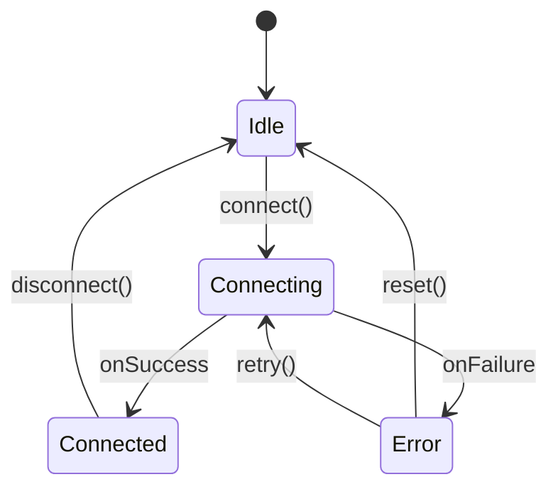
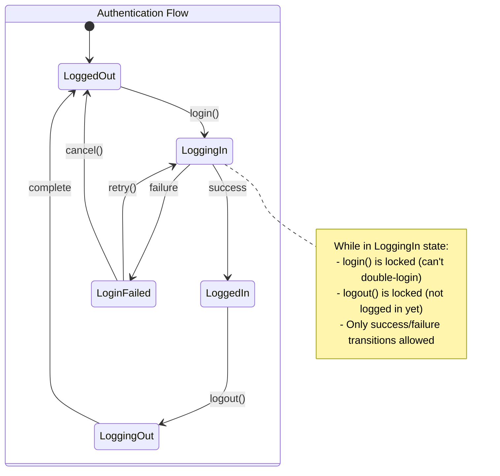
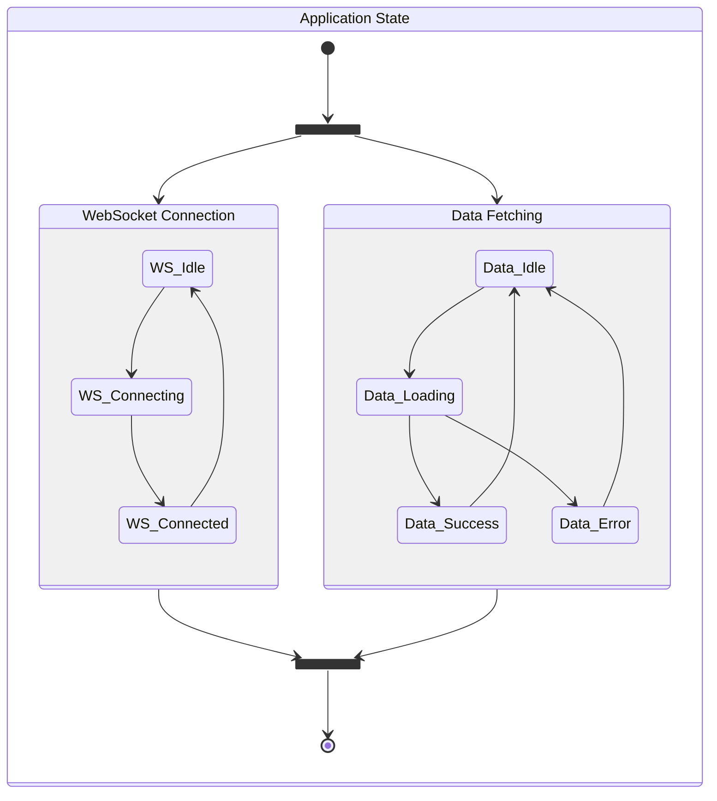
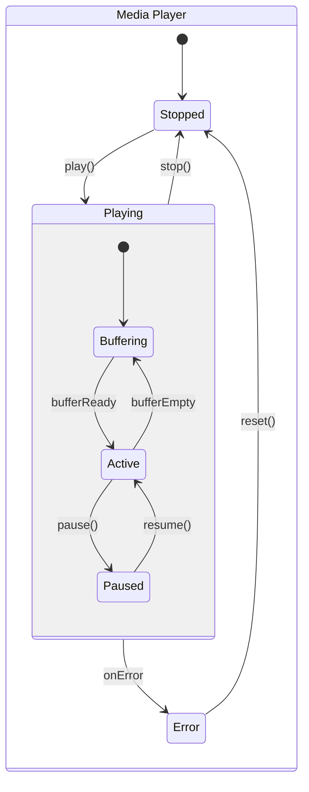

# sdk-design-question

To install dependencies:

```bash
curl -fsSL https://bun.sh/install | bash
bun install
```

To run:

```bash
bun run src/index.ts
```

## Task

Design a "better" state machine library that uses **discriminated unions** and has a clean, simple zustand-like API.

### Requirements

- **Type safe**: All states, transitions and actions must have contracts explicitly defined in the type system
- **Discriminated unions**: Use TypeScript discriminated unions for state representation
- **Clean API**: Similar simplicity to zustand but built for state machines

### Example State Machine


<details>
<summary><b>📚 Need clarification on state machines or discriminated unions? (Click to expand)</b></summary>

### What is a State Machine?

A **state machine** is a computational model that can be in exactly one of a finite number of states at any given time. The machine transitions from one state to another in response to external inputs (actions/events). The key concepts are:

1. **States**: Distinct modes of operation (e.g., idle, connecting, connected, error)
2. **Transitions**: Rules defining how to move between states  
3. **Actions**: Events that trigger transitions
4. **Guards**: Conditions that must be met for a transition to occur

### What are Discriminated Unions?

**Discriminated unions** (tagged unions) are a TypeScript pattern for creating types that can be one of several different shapes, with a common property (the "discriminant") that TypeScript uses to narrow the type:

```typescript
// The 'kind' property is the discriminant
type WebSocketState = 
  | { kind: 'idle' }
  | { kind: 'connecting'; attempt: number }
  | { kind: 'connected'; socket: WebSocket; connectedAt: Date }
  | { kind: 'error'; message: string; canRetry: boolean }
```

### Architecture Patterns

#### Basic State Transition Diagram


#### Transition Locking Pattern
State machines ensure that only valid transitions can occur from each state, preventing impossible states and race conditions:



#### Parallel State Machines
Complex applications often need multiple state machines working together:



#### Hierarchical State Machines
States can contain sub-states for more complex behaviors:



### Why Combine State Machines with Discriminated Unions?

1. **Type Safety**: TypeScript ensures you handle all states and only access properties that exist
2. **Exhaustiveness Checking**: The compiler warns if you forget to handle a state
3. **Impossible States Prevention**: Can't accidentally be in multiple states simultaneously
4. **Clear Contracts**: Transitions are explicitly defined in the type system

</details>

### Expected Usage

It should be usable like this:

```tsx
const useWebsocketStore = () => {
  // YOUR SDK used here

  // define state.kind (types of the state of the state machine explicitly)
  // define state transitions explicitly (which states can go to which other states)
  // define actions how the state has a transition to another state explicitly
  // these are the contracts of the state machine

  return { state, actions };
};

const App = () => {
  const { state, actions } = useWebsocketStore();

  switch (state.kind) {
    case "idle": {
      return <button onClick={() => actions.connect(state)}>Connect</button>;
    }
    case "connecting": {
      return <p>Connecting...</p>;
    }
    case "connected": {
      return (
        <button onClick={() => actions.disconnect(state)}>Disconnect</button>
      );
    }
    case "error": {
      return <p>Something went wrong: {state.errorMessage}</p>;
    }
  }
};
```

Use `test/sdk.tsx` to design the API.

### Implementation Details

The seeded code is in `src/` from `zustand`. Feel free to throw it out if you'd prefer, but use it as a start on how to build this type of tool - you can choose another API if you find that better.

### Submission

Reply to the email you got with the zipped folder after an hr (max 75 mins) after you start.

### References

1. [zustand](https://github.com/pmndrs/zustand) - Also have an `example_zustand.tsx` file inside docs you can look at
   ```ts
   // Basic Zustand example
   import { create } from 'zustand'

   // Define your store
   const useStore = create((set) => ({
     // State
     count: 0,
     
     // Actions
     increment: () => set((state) => ({ count: state.count + 1 })),
     decrement: () => set((state) => ({ count: state.count - 1 })),
     reset: () => set({ count: 0 }),
   }))

   // Use in a component
   function Counter() {
     const { count, increment, decrement, reset } = useStore()
     
     return (
       <div>
         <h1>{count}</h1>
         <button onClick={increment}>Increment</button>
         <button onClick={decrement}>Decrement</button>
         <button onClick={reset}>Reset</button>
       </div>
     )
   }
   ```

2. [discriminated unions](https://www.typescriptlang.org/docs/handbook/2/narrowing.html#discriminated-unions)
   ```ts
   // Basic TypeScript discriminated union example
   type NetworkState =
     | { status: 'disconnected' }
     | { status: 'connecting' }
     | { status: 'connected' }
     | { status: 'error'; errorMessage: string };

   // Using the discriminated union
   function handleNetworkState(state: NetworkState) {
     // The 'status' property acts as the discriminant
     switch (state.status) {
       case 'disconnected':
         return 'Ready to connect';
       case 'connecting':
         return 'Establishing connection...';
       case 'connected':
         return 'Connection established';
       case 'error':
         // TypeScript knows 'errorMessage' exists only in this case
         return `Error: ${state.errorMessage}`;
     }
   }
   ```