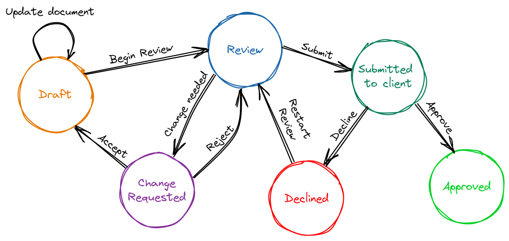

# sdk-design-question

To install dependencies:

```bash
curl -fsSL https://bun.sh/install | bash
bun install
```

To run:

```bash
bun run src/index.ts
```

## task

i want you to design a "better" state machine library, ideally i want it to use `discriminated unions`, and a clean simple zustand like `api`


this is a sample state machine


it should be type safe, it should have state, transitions and action definitions. this means i want these **"CONTRACTS" explicitly defined** in the type system

the seeded code is in `src/` from `zustand` feel free to throw it out if you'd prefer, but would use it as a start on how to build this type of tool - you can choose another api if find that better


it should be usable like this
```tsx
const App = () => {
  const { state, actions } = useWebsocketStore();

  switch (state.kind) {
    case "idle": {
      return <button onClick={() => actions.connect(state)}>Connect</button>;
    }
    case "connecting": {
      return <p>Connecting...</p>;
    }
    case "connected": {
      return (
        <button onClick={() => actions.disconnect(state)}>Disconnect</button>
      );
    }
    case "error": {
      return <p>Something went wrong: {state.errorMessage}</p>;
    }
  }
};
```


### references

1. [zustand](https://github.com/pmndrs/zustand) 
   ```ts
   // Basic Zustand example
   import { create } from 'zustand'

   // Define your store
   const useStore = create((set) => ({
     // State
     count: 0,
     
     // Actions
     increment: () => set((state) => ({ count: state.count + 1 })),
     decrement: () => set((state) => ({ count: state.count - 1 })),
     reset: () => set({ count: 0 }),
   }))

   // Use in a component
   function Counter() {
     const { count, increment, decrement, reset } = useStore()
     
     return (
       <div>
         <h1>{count}</h1>
         <button onClick={increment}>Increment</button>
         <button onClick={decrement}>Decrement</button>
         <button onClick={reset}>Reset</button>
       </div>
     )
   }
   ```
2. [discriminated unions](https://www.typescriptlang.org/docs/handbook/2/narrowing.html#discriminated-unions)
  ```ts
  // Basic TypeScript discriminated union example
  type NetworkState =
    | { status: 'disconnected' }
    | { status: 'connecting' }
    | { status: 'connected' }
    | { status: 'error'; errorMessage: string };

  // Using the discriminated union
  function handleNetworkState(state: NetworkState) {
    // The 'status' property acts as the discriminant
    switch (state.status) {
      case 'disconnected':
        return 'Ready to connect';
      case 'connecting':
        return 'Establishing connection...';
      case 'connected':
        return 'Connection established';
      case 'error':
        // TypeScript knows 'errorMessage' exists only in this case
        return `Error: ${state.errorMessage}`;
    }
  }
  ```